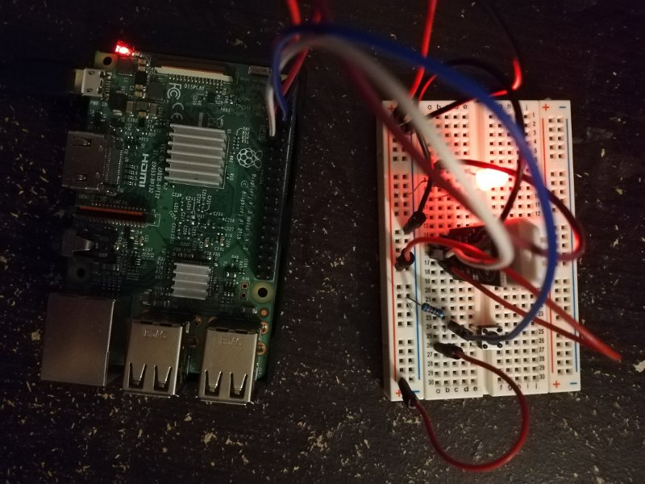

### Multimeter



```bash
source aliases.sh
docker-compose up -d
python3 src/entry.py hello 5
```

### TODO.ci
###### Deploy to falcon9 worker:  
`docker service create --name falcon9 -constraint node.labels.name==falcon9 alpine ping 8.8.8.8`

##### Packages
> For Docker services

###### System
- python
- nginx
- python3-pip build-essential libncurses5-dev libncursesw5-dev libreadline6-dev libgpiod2
- libbz2-dev libexpat1-dev liblzma-dev zlib1g-dev libsqlite3-dev libgdm-devtk8.5-dev python-dev libssl-dev openssl
- sudo apt-get install     apt-transport-https     ca-certificates     curl     gnupg-agent     software-properties-common
 

###### System
- pip
- rpi.gpio
- RPI.GPIO
- adafruit-blinka
- adafruit-circuitpython-dht


